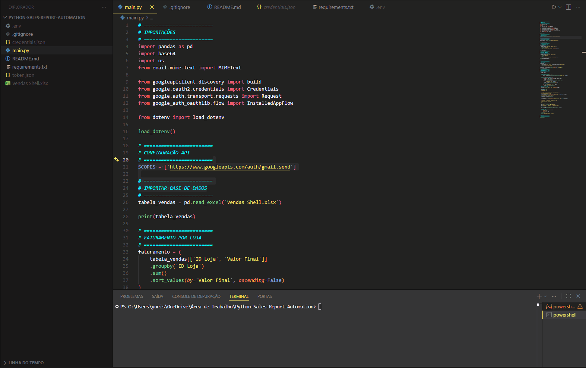

# 📊 Sales Report Automation

---

## 🇺🇸 English

### 🚀 Overview

This project automates the generation of sales reports and sends them via email using Gmail API integration.

It was designed to simulate a real business scenario where manual reporting is time-consuming and prone to errors.

---

## 🔄 Workflow

```text
📥 Excel File (.xlsx)
        ↓
⚙️ Data Processing (Pandas)
        ↓
📊 KPI Calculation
(Revenue • Quantity • Ticket)
        ↓
🧾 HTML Email Generation
        ↓
📧 Gmail API إرسال
        ↓
✅ Email Sent Successfully
```
---

## ▶️ Execution Demo

Below is a demonstration of the script running and sending the email automatically:



---

### 💡 Problem Solved

Manual sales reporting can take hours and is highly susceptible to mistakes.

This solution:

* Eliminates repetitive tasks
* Reduces human error
* Delivers fast and reliable insights

---

### ⚙️ Features

* 📥 Data extraction from Excel
* 📊 Revenue calculation by store
* 📦 Quantity sold per store
* 💰 Average ticket calculation
* 📈 Automatic sorting (highest to lowest)
* 📧 Email delivery with formatted HTML tables
* 🔐 Secure authentication using Gmail API (OAuth2)

---

### 🔥 Highlights

* Real API integration (Gmail API)
* End-to-end automation (data → analysis → email)
* Clean and structured Python code
* Business-oriented solution

---

### 🧠 Technologies Used

* Python
* Pandas
* Gmail API
* OAuth2
* HTML

---

### 📦 Installation

```bash
pip install -r requirements.txt
```

---

### ▶️ Run

```bash
python main.py
```

---

### 🔐 Environment Variables

Create a `.env` file:

```bash
EMAIL_DESTINO=your_email@gmail.com
```

---

### 📬 Output

The system sends an email containing:

* Revenue by store (descending order)
* Quantity sold
* Average ticket

All data is presented in structured HTML tables.

---